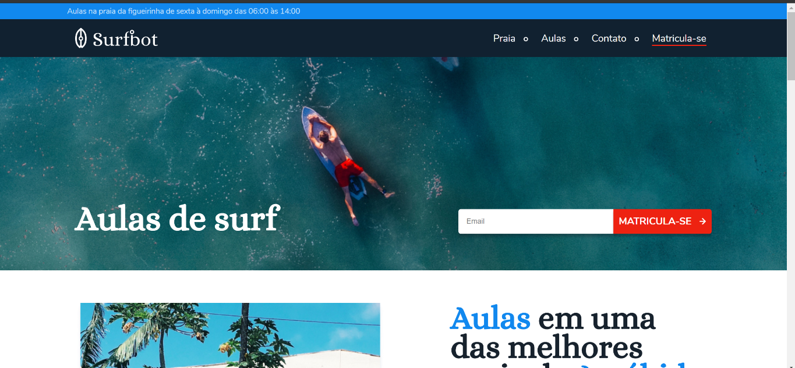

# Surfbot - aulas de surf

## Tópicos 

[Sobre o surfbot](#sobre-o-surfbot)

[Tecnologias](#tecnologias)

[Licença](#licença)

 

## Sobre o Surfbot

Surfbot é uma plataforma onde o usuário pode ter aulas de surf. Efetuando pagamento em sua respectiva modalidade (infantil, adulto ou profissional).

Esse projeto foi desenvolvido para a pratica e aprimoramento em UI Design e Codificação.

 

  

## Tecnologias

As seguintes tecnologias foram utilizadas no desenvolvimento do projeto:

UI Design
- Tipografia
- Teoria das cores
- Grid
- Componentes da Interface
- Espaçamento

Codificação
- HTML
- CSS
- JavaScript

 

 

## Licença

Esse projeto está sob a licença MIT. Veja o arquivo [LICENSE](/LICENSE) para mais detalhes.

---

Feito com :purple_heart: by [Wanderson Oliveira](https://github.com/wanderson1873)